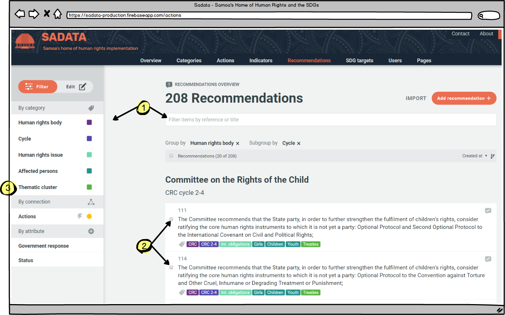
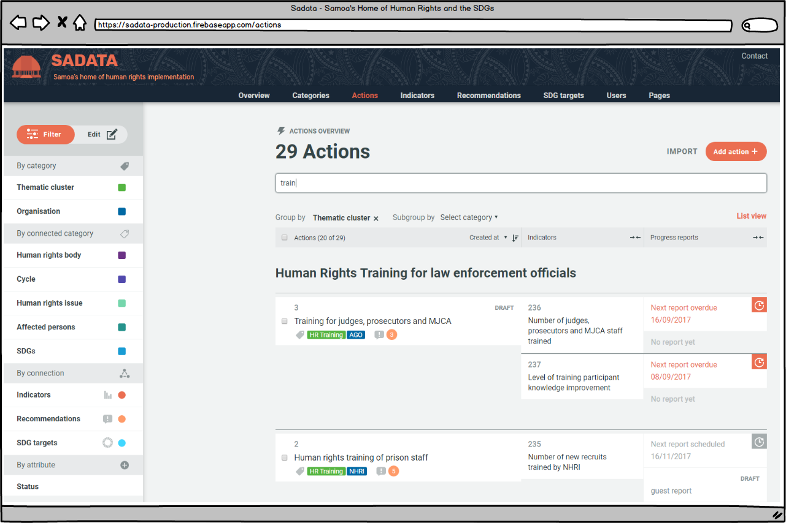

## 2.2 Create Your National Implementation Plan

The National Implementation Plan consists of the obligations (and other objectives) of the State in relation to human rights and the SDGs. It also contains the actions the Government is planning to do to target those objectives and contains the data of progress achieved to date.

The obligations, which form the basis of the National Implementation Plan, can be

* the SDS stratregic outcomes,
* the SDG targets,
* the human rights recommendations and observations received from the Universal Periodic Review, the Treaty Body Committees, the Special Procedures or
* the substantive articles and general recommendations of the Treaties themselves.

These are often overlapping in nature so the application helps the user to create a National Implementation Plan where all linkages are identified, eliminating duplication of reporting, helping to foster a coordinated implementation approach and to identify any gaps from the outset. If an integrated national Implementation Plan is developed for multiple frameworks any crossover can also be identified and duplication of efforts reduced further.

Once the National Implementation Plan has been developed, users of the application will add regular progress reports and anyone will be able to track how well implementation is progressing.

### Creating Your Human Rights Implementation Plan in 3 Easy Steps

#### 1.Enter human rights recommendations or convention articles

This can either be done by importing recommendations in bulk or entering them one by one. Simply click on the 'Objectives' tab in the top menu bar and get going.

> For more information on adding objectives [go to chapter 4.6](../members/objectives.md).

#### 2. Cluster your recommendations

By creating clusters the wide ranging obligations become more manageable and easier to track. There are two ways to cluster recommendations and articles. The most efficient is to go to the 'Recommendations' tab in the top menu bar as above and (1) use the filtering and search functions to find similar obligations, (2) select them and then (3) click on 'Thematic Cluster' in the left hand menu bar to create and name a new cluster to put them in.

Alternatively, recommendations or articles could be allocated to clusters individually by finding the one you want, clicking on it to edit and assigning it to a cluster. More information on both approaches can be found [in chapter 4.6](../members/objectives.md).

> For more information on the difference between 'filtering' and 'editing' [go to chapter 4.2](../members/content.md).

#### 3. Add Actions and Indicators

Now that the objectives for the National Implementation Plan have been created all that is left to do is add the actions (and associated indicators) they are targeted by. Adding actions and indicators can also be done individually or by importing multiple entries at once. First click on the 'Action' or 'Indicator' page in the top menu bar and then select whether to import or add.

If adding multiple entries then the actions/indicators can then be assigned to clusters or individual recommendations/articles using the filter and edit process. If adding one by one then at the time of creation this can be done. Additionally, if you are creating a single action you can also create the indicator(s) associated with it as part of the same process, without having to click on the 'indicators' tab in the top menu bar.

> For more information on how to carry out these functions [see chapter 4.4](../members/actions.md).

Whilst multiple indicators can be imported it is important to edit each one individually as this is where responsibility for an indicator can be allocated to a user. For instance if Rosemary Bowe is responsible for conducting human rights training for new police recruits every six months then she needs to be given responsibility for uploading the training data twice a year. This can be done when creating a new indicator or editing an old indicator. Rosemary must be an existing registered user or will need to be sent a registration link for this to happen.

Actions and indicators can and should also be linked to the objectives from other frameworks where appropriate. For instance if the work Rosemary is doing, as described above, also helps to meet SDG target 16.3 it can be linked when the action or indicator is being created. That means that any data Rosemary uploads will also be tracked against SDG 16.3 even though it is only uploaded once.

> _**Top Tip**_ _States should start off by looking at what is already planned in the coming years which will already address the thematic clusters and once this is done that will identify where the gaps are and actions can be devised to help meet these gaps. At any point it is easy to check whether gaps exit by going to the recommendations page and filtering to see which recommendations do not currently have any actions._

#### Finally: Monitor and update

The Implementation Plan is never finished! States will continue to receive additional recommendations from the Treaty Body Committees, the UPR and the Special Procedures. Once any new recommendations are received then these need to be entered into the database, assigned to existing or new clusters and actions assigned to them to make sure they are addressed.

#### Implementation Plans for other frameworks

The SDG Implementation Plan works in exactly the same way as above except for the need for clustering the targets as this has already occurred given they are grouped within specific SDGs. If a State is using the software for both human rights and SDG reporting then as soon as they have finished developing one then work has already started on the other, as actions will have been linked across the two plans. It then just requires the State to identify the gaps and add in extra actions and indicators.

The SDG Implementation Plan can be developed on its own using the steps above (omitting the thematic clustering), as can the Human Rights Implementation Plan. however, States receive additional benefits from using the two in conjunction with each other as it eliminates duplication of reporting and activities across human rights obligations and the SDGs.

#### An Example Implementation Plan

_screenshot covering an illustrative section_
