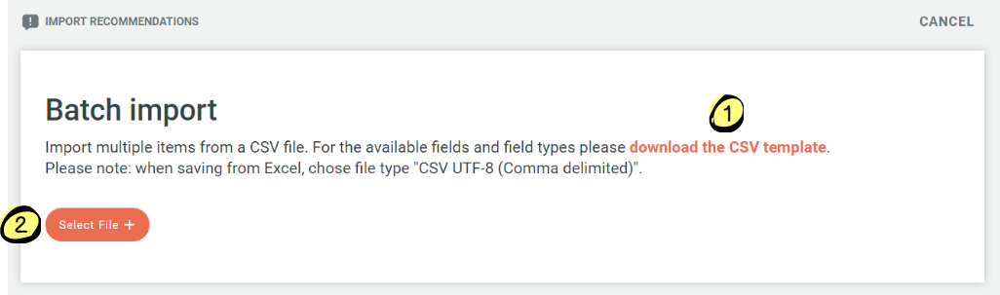
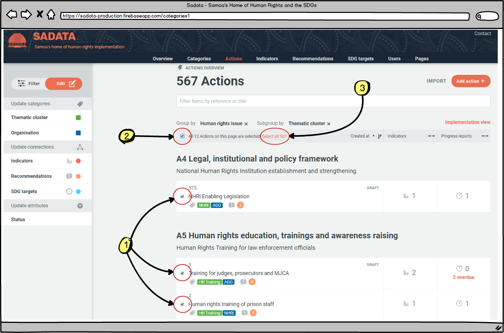
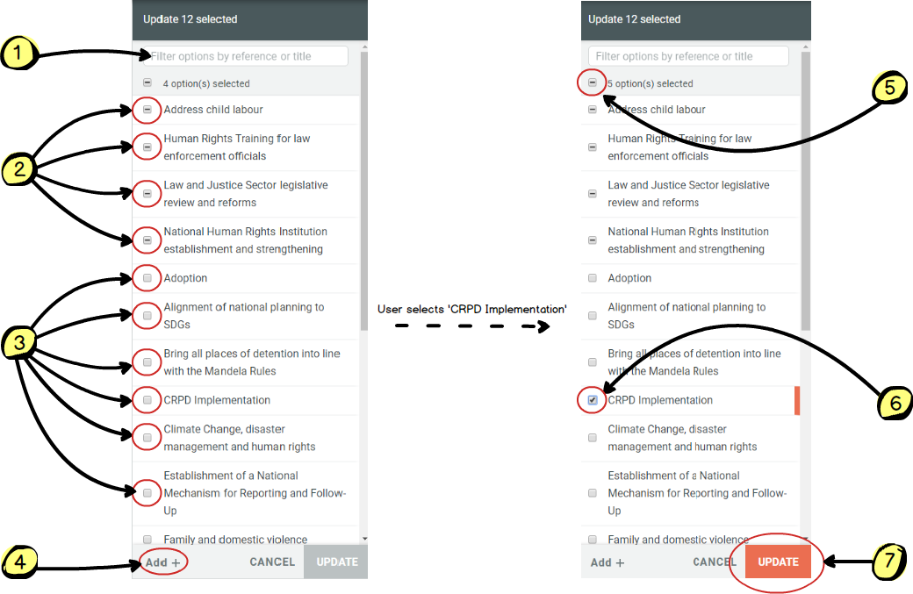

## 2.5 How to: Edit and Add Entities

The database is made up of information entered into it by the State and is designed so that it is flexible and can be used in a way that meets the needs of any country. All of the information and categorisations are totally flexible and can be created and edited as needed. The following can be classified as entities within the database:

* Categories (human rights body, reporting cycle, human rights issue, affected persons, thematic clusters, organisations, SDGs)
* Actions
* Indicators
* Recommendations
* SDG Targets

> _**Key Fact**_ _To edit or addentities you need to be assigned as an 'Administrator' or 'Manager' after you register as a user. For more information on user roles [see chapter 4.1](../members/user-roles.md)._

### Adding New Entities

**Adding Single Entities**

Adding new entities is very straight forward. The Administrator or Manager simply needs to navigate to the page relevant to the entity they wish to create. I.e. either categories, actions, indicators, recommendations or SDG targets. On each of these pages is an 'add' button placed in the top right hand corner of the content frame. On all of the pages other than the categories page there is also an 'import' button.

To add a single entity simply click on the 'add' button and enter all of the required details.

> For full details of what information is required refer to the 'add' section in the relevant pages for [categories (4.3)](../members/categories.md), [actions (4.4)](../members/actions.md), [indicators (4.5)](../members/indicators.md), or [objectives (4.6)](../members/objectives.md).

**Importing Multiple Entities**

A time-efficient way to add new actions, indicators, recommendations or SDG targets is to use the 'import' function to import multiple entities in one go. The process for importing is the same for the different types of entity. First, the Administrator or Manager clicks on the import button as shown above on the relevant entity page - the following box will then appear:

1. Clicking on this link allows the Administrator or Manager to download a CSV template for importing multiple entities. If the template structure is not used then the batch import will not work. The Administrator or Manager should download the template, copy and paste their data into this file and then save it using an appropriate file name.

2. Once step 1 has been completed the Administrator or Manager clicks on the 'select file' button and chooses the file from their computer. The batch import will then commence and a progress bar will appear until the upload is complete. The entities will now appear in the database.

> _**Key Fact**_ _When batch importing, it is only possible to import the following:_
>
> * _For actions: title, description, target date, target date comment_
> * _For indicators: title, reference, description_
> * _For recommendations: title, reference, government response_
> * _SDG target: title, reference, description_
>
> _It is not possible to assign entities to categories, tag with connected categories, link to connections or assign draft/public status. This can be done when adding individual entities but not importing multiple entities. Instead, the Administrator should use the batch edit function (see above) to assign, tag and link immediately after importing._

### Editing Entities

**'Edit' v 'Filter' Mode**

'Filter' mode is available to all registered users and visitors and allows for actions, indicators, recommendations or SDG targets to be filtered by category, connected category, connection or status.

The edit function is available only to **Administrators and Managers.**

1. Once an Administrator or Manager is signed in the filter list now becomes a filter or edit list, with filter selected as the default (coloured orange)

2. Options to select the page of results or individual results now also appear.

As soon as any of the results are selected by the user the mode will automatically switch from 'filter' to 'edit'

Once the Administrator or Manager is in 'Edit' mode they can update the selected entries (either Actions, Indicators, Recommendations or SDG Targets) and change the entry associations (e.g. the category tags, actions, indicators, thematic cluster). This allows the Administrator or Manager to edit entries in bulk.

To edit any entity an Administrator or Manager can simply click on the entity they wish to edit at any time, on any of the pages of the application. Clicking on the entity will bring up the full details and an 'edit' button.

**Editing a Single Entity**

_Example: Editing an affected person category_

First the Administrator needs to navigate to where their entity can be found. To edit any category (as listed above) the Administrator needs (1 below) to click on the 'Categories' link in the top menu bar and then (2) click on the relevant taxonomy. Clicking on any of the categories (3), such as 'Children', brings up the second image below, from where the Administrator can go in to edit the entity and all associations it has (e.g. linked recommendations, actions, etc.):

The same approach is required to any action, indicator, recommendation or SDG target - simply find the entity in question, click on it and hit the 'edit' button to get going.

> For more detailed instructions on how to edit please see the relevant sections for [categories (4.3)](../members/categories.md), [actions (4.4)](../members/actions.md), [indicators (4.5)](../members/indicators.md), or [objectives (4.6)](../members/objectives.md).

**Batch editing**

Batch editing is a powerful function of the application as it allows Administrators or Managers to update multiple entities in a single move, saving considerable time and effort.

Batch editing can be carried out in relation to actions, indicators, recommendations and SDG targets, but not categories. It allows an Administrator or Manager to update multiple entities at once in any of the following ways:

* Add multiple actions or indicators to a thematic cluster
* Assign multiple actions or indicators to an organisation
* Assign multiple indicators to an SDG
* Tag multiple actions or recommendations with any connected category (human rights body, cycle, human rights issue, affected persons, SDGs)
* Link multiple actions or indicators to any connection (action,indicator, recommendation or SDG target)
* Link multiple recommendations to actions
* Change the draft/public status of multiple actions, indicators, recommendations or SDG targets
* Change or denote the Government response to multiple UPR recommendations

The batch edit function works in the same manner for all of the above use cases and is demonstrated below.

First the Administrator or Manager needs to identify and select the actions they wish to batch edit and then secondly they update the selected actions as they wish.

1. The Administrator or Manager can select the actions they wish by first using the filtering and search functions to bring up the relevant actions on their screen. More information on how to use these functions can be found [in chapter 3.4](../visitors/actions.md). Once the relevant actions have been identified the Administrator or Manager can either:

  * Select individual actions using the checkbox next to each action (see \#1 on image below)
  * Select all actions on the page displayed (see \#2 on image below)
  * Select all actions returned by the search and filtering results if they do not fit onto a single display page (see \#3 on image below)

2. Once the relevant actions have been selected the Administrator or Manager can then use the menu on left hand side of the screen to link the selected actions to any category, connected category or connection. For example, if the selected actions were to be linked to a particular thematic cluster the Administrator or Manager would click on the thematic cluster title in the left hand menu bar and the box 1 below will appear. Box 2 shows what happens when the Administrator or Manager selects the thematic cluster they wish to link to the actions:

1. The Administrator or Manager can use the filter box to search for the thematic cluster (or category/connection) they wish to find

2. Where some, but not all of the selected actions are already linked to a thematic cluster the Administrator or Manager is shown a box with a horizontal line. By clicking once on any of these boxes (so that a tick appears) and then 'Update' the Administrator could update the thematic cluster to either be linked with **all** of the selected actions. By clicking on the box twice (so that the box is empty) and then 'Update' the Administrator or Manager can **unlink** all of the selected actions from that thematic cluster.

3. Where a thematic cluster is not currently linked to any of the selected actions the Administrator or Manager is shown a blank box. By clicking once in any of these boxes (so that a tick appears) and then 'Update' the Administrator could update the thematic cluster to either be linked with **all** of the selected actions. In this example, the box on the right demonstrates how this works if the Administrator or Manager selects 'CRPD Implementation'

4. If a thematic cluster does not exist which the Administrator or Manager wishes to link all of the selected actions to they can create one using this button

5. At the top of the list is a summary of how many thematic clusters are already linked to all or some of the actions. By clicking once on this box (so that a tick appears) and then 'Update' the Administrator or Manager can link **all** of the selected actions to **all** of the thematic clusters**.** By clicking on the box twice (so that it is blank) and then 'Update' the Administrator or Manager can unlink all of the selected actions from all of the thematic clusters.

6. When a thematic cluster is selected then a tick will appear in the box

7. The 'Update' button will only be active once the Administrator or Manager has made one of the changes described above. Clicking on the update button will save those changes. This may take several seconds if editing a large number of actions at once.

---
