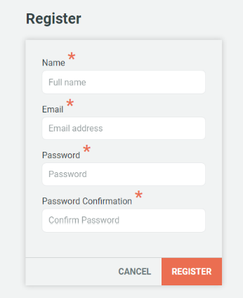

## 2.7 How to: Register

Users have to be registered in the following way:

1. Click on the 'Register' link in the top right hand corner of any page, as circled above.

2. Complete the registration form, entering name, email address and a confirmed password (see image below)

> _It is important to note that simply registering as described above only allows the user to contribute draft progress reports to indicators as a Guest Contributor ([also see chapter 2.3](../howto/reporting-and-follow-up.md)). To publish and edit other information, specific user permission rights have to be granted by an Administrator or Manager. Please refer to [chapter 4.9](../members/users-admin.md) for more details_

---
