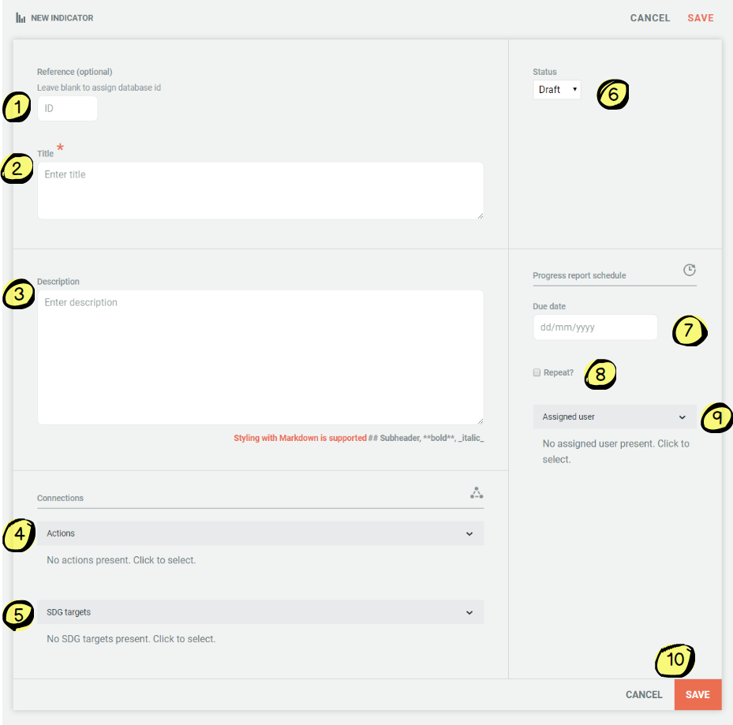
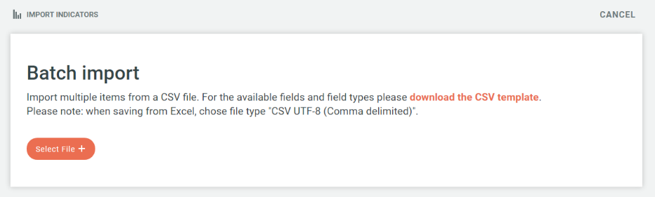
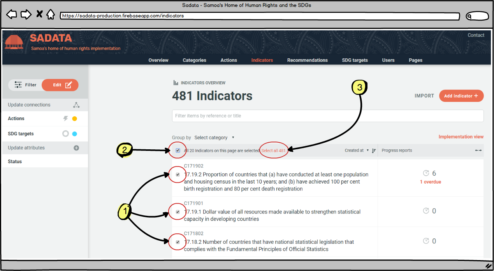
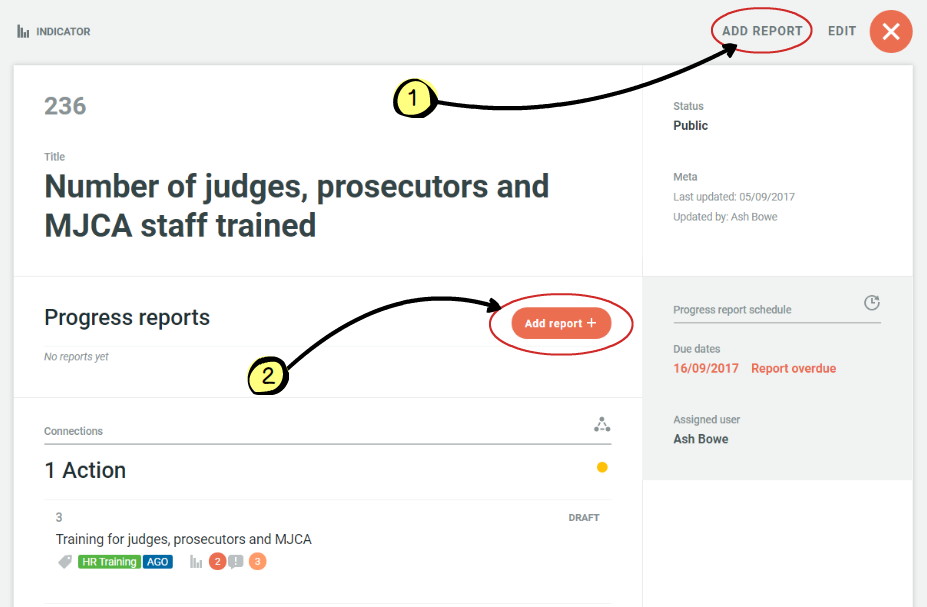

## 4.5 Add/edit indicators

Administrators and Managers can 'add or edit' data via the Indicators page. They are both also able to add progress reports to indicators.

### Adding Indicators

There are two ways for an Administrator to add indicators:

1. Add single indicators

2. Import a file of multiple indicators

Both methods of adding actions can be accessed via the buttons in the top right hand corner of the actions page (pictured above).

#### Adding a single indicator:

Click on the 'Add Indicator' icon and the following form will appear:

1. ID: Administrator can add an indicator ID. If left blank an ID will automatically be assigned.

2. Title: Short title of indicator

3. Description: Additional details of indicator

4. Actions: Clicking on the drop down menu allows the Administrator to link the indicators to any of the actions contained within the database. At the bottom of the drop down menu is also an 'Add' button where the Administrator can choose to add a new action from here to link to the indicator if they wish.

5. SDG Targets: Clicking on the drop down menu allows the Administrator to link the indicator to any of the SDG targets. At the bottom of the drop down menu is also an 'Add' button where the Administrator can choose to add a new SDG Target from here to link to the indicator if they wish.

6. Status: Automatically set to draft, the Administrator can change this to public once the indicator is ready to be published on the public site. The status of actions can also be changed in bulk using the filtering system on the indicator page (see below)

7. Due date: The due date for the next indicator report

8. Repeat? If the indicator requires regular report (e.g. gender based violence statistics every quarter) then a repeat data report due date can be set, meaning the user responsible for providing the data reports will receive regular email reminders on the dates set

9. Assigned user: Clicking on the drop down menu allows the Administrator to choose from all of the registered users who is responsible for this indicator. Once allocated, this user will receive automated email reminders when progress reports are due

10. Cancel/Save: This is where the Administrator can save all of the details that have been entered, or clear the form using the cancel button

#### Adding multiple indicators

By clicking on the 'Import' button (top image) the Administrator will be provided with a CSV template download (see image below) for batch importing multiple Indicators. Once in the required format the Administrator can click on the 'Select File' button and upload their file and all of the Indicators will automatically be imported.

### Editing Indicators

There are also two ways in which Indicators can be edited; individually and batch editing.

#### Individual editing

Individual editing is as simple as finding the indicator you wish to edit, using the search and filtering functions and clicking on the indicator title in question, which brings up the following screen with an Edit button (circled):

Clicking the edit button allows the Administrator to edit all of the fields associated with that indicator including:

* Adding/editing the assigned user responsible for progress reports
* Adding/editing the due date for progress reports
* Adding/editing the actions the indicator is linked to
* Adding/editing the SDG targets the indicator is linked to
* Editing the draft/public status of the indicator
* Deleting the indicator
* Editing the title, description or reference of the indicator

#### Batch editing

Batch editing of indicators (or other entities such as recommendations, actions or SDG targets) is a powerful feature that allows Administrators to efficiently edit indicators in a variety of ways including:

* By setting the status of multiple indicators from draft to public
* By linking multiple actions with any connection (i.e. action or SDG targets)

Batch editing is a simple process - first the Administrator needs to identify and select the indicators they wish to batch edit and then secondly they update the selected indicators as they wish.

1. The Administrator can select the indicators they wish by first using the filtering and search functions on the 'Indicators' main page to bring up the relevant indicators on their screen. More information on how to use these functions can be found [here](../visitors/actions.md). Once the relevant indicators have been identified the Administrator can either:

  * Select individual indicators using the checkbox next to each action (see \#1 on image below)
  * Select all indicators on the page displayed (see \#2 on image below)
  * Select all indicators returned by the search and filtering results if they do not fit onto a single display page (see \#3 on image below)

2. Once the relevant indicators have been selected the Administrator can then use the menu on left hand side of the screen to link the selected indicators to any action or SDG target, or update the status from draft to public (or vice versa). Batch editing indicators is the same process as for actions. More details on how to carry out this function can be found [here](../members/actions.md).

### Adding Unscheduled & Scheduled Progress Reports

Administrators may be required to add progress reports to an indicator - either unscheduled or scheduled. They can do that by searching for the relevant indicator using the filter and search function and then clicking on the title. The next scren then provides two opportunities to add a progress report. See below:

Clicking on either of these links will take the Administrator to the following form:

1. Title: The title of the progress report (E.g. 'Domestic violence stats Q3 2017' or 'NHRI CEDAW Training Workshop for Police Recruits'

2. Description: Full details of the progress report

3. Upload document: Information/data related to the indicator should be uploaded via this link

4. Public/Private: The status of the uploaded document can be set to public or private depending on whether there is sensitive information contained within that should not be available publicly

5. Draft/public: The status of the progress report. Once it is ready to publish on the public site, this status should be immediately changed to public.

6. Due date: As an administrator, both scheduled and unscheduled progress reports can be entered. The Administrator is required to indicate here whether the progress report they are uploading is unscheduled or scheduled.

7. Save/cancel: This is where the Administrator can save all of the details that have been entered, or clear the form using the cancel button

For more information on adding progress reports [click here](../howto/reporting-and-follow-up.md).

---
