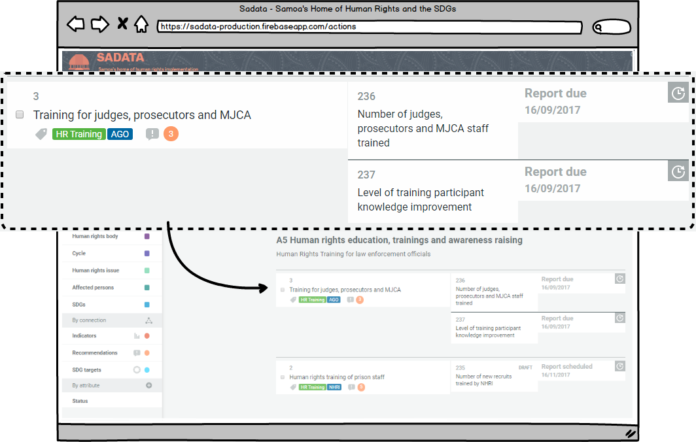

## 4.1 User roles & responsibilities

### Role: Visitor

Any member of the public that is not registered or logged in. This manual contains a whole chapter on how Visitors can make the most out of visiting this site. To read, [click here](../visitors/using-as-a-visitor.md).

##### Rights

* Access and explore all published information using the filters and search functions
* Track progress on the National Implementation Plan and thus how the Government is performing

---

### Role: Guest

Role implicitly assumed when registered

##### Rights

* Can create draft progress reports \(thus become user type "Guest Contributor"\)
* All the above

#### Function: Guest contributor

Contributors are registered users who can submit information relating to the National Implementation Plan or the SDGs, but don't have to be part of the Government. NGOs, NHRIs or any member of the public can thus contribute data to show progress towards any part of the National Implementation Plan or SDGs. This gives groups and individuals a platform to showcase their work to Government and to encourage more coordinated activities. For instance, a contributor could be an NGO who has been doing work in a particular area that is helping to achieve one of the areas of the Implementation Plan or the SDGs. Any organisation or individual can register as a user and contribute data as they see fit. In addition to raising awareness of the work they are doing this can also help to foster better coordination of activities with Government. For more information on adding reports, click [here](../howto/reporting-and-follow-up.md).

##### Responsibilities

* Add progress reports to existing indicators and upload data. Note: progress reports will have to be reviewed and published first by an authorised user to become public

---

### Role: Contributor

##### Rights

* Can be assigned to indicator
* Can create public progress reports for assigned indicators
* Can view draft content
* All the above

#### Function: Indicator Manager

The data owner for an indicator and this are key to the success of the data entry - they are the registered users who upload information against all of the indicators. Once assigned to an indicator the user becomes responsible for uploading data at the required time. For more information on adding reports, click [here](../howto/reporting-and-follow-up.md).

##### Prerequisites

* Assigned to indicator \(by user with at least role "Manager"\)

##### Responsibilities

* Add progress reports and upload data for the indicator the user has been assigned to
* Receive automated reminder emails when a progress report is due \(weekly, 30 days ahead of due date\) and overdue \(daily, after due date has passed\)

##### Example

_All information demonstrated is for illustrative purposes only_

The image above demonstrates what actions, indicators and look like in the Implementation Plan. In the example highlighted, two indicators have been set for the Action \(training for judges, prosecutors and MJCA\). The final column demonstrates when the information relating to those indicators is due. On that date the user who has been assigned to these indicators - in this case likely the training facilitator - will receive an email with a link requesting that they upload the information for each.

Should they fail to do so then they will continue to receive email reminders until the data has been uploaded. This is the first safeguard against non-entry built into the application. Data can be uploaded in any file type format.

---

### Role: Manager

##### Rights

* Can be assigned to a category \(thus become user type "Category Manager"\)
* Can assign Contributor to indicator
* Can promote Guest to Contributor
* Can create and update categories and other entities \(except pages\)
* All the above

#### Function: Category Manager

The person responsible for an area of the National Implementation Plan \(e.g. UPR recommendations, CRC recommendations, SDG targets, etc.\) and thus for sets of recommendations. Category Managers play an oversight role to ensure that data is entered when required - thus providing the second safeguard against non-entry of data.

For each 'Human Rights Body' category, as well as for each SDG, a 'Category Manager' should be assigned by one of the Administrators.

At each NMRF quarterly meeting each Manager should provide an overview of recently added data/information to the Working Group.

##### Prerequisites

* Assigned to suitable category

##### Responsibilities

* Assign users to indicators
* Oversee and follow-up data collection
* Receive automated reminder emails when a progress report is overdue \(weekly, after due date has passed\) for indicators in the assigned area.
* Raise repeated failure to upload with the relevant Ministry at the next scheduled meeting of the National Mechanism for Reporting and Follow-Up.
* Review and publish progress reports added by **Guest Contributors**
* Should provide an overview of recently added data/information to the Working Group at each NMRF quarterly meeting

#### Function: Implementation Plan Manager

Responsible for developing and updating the National Implementation Plan.

##### Responsibilities

* Create and edit recommendations, actions and indicators, as well as categories
* Connect and categorise recommendations, actions and indicators
* Adding newly received recommendations into the database and assigning them to clusters, as directed by the NMRF
* Maintaining and updating the category lists

---

### Role: Administrator

##### Rights

* Can assign Manager to category
* Can promote users to Manager and Administrator
* Can create and update pages
* All the above

#### Function: Content Editor

Responsible for editorial content.

##### Responsibilities

* Create and update content pages

#### Function: Application administrator

Application administrators play a critical role in maintenance of the application.

##### Rights & Responsibilities

* Manage users
* Report bugs

---
