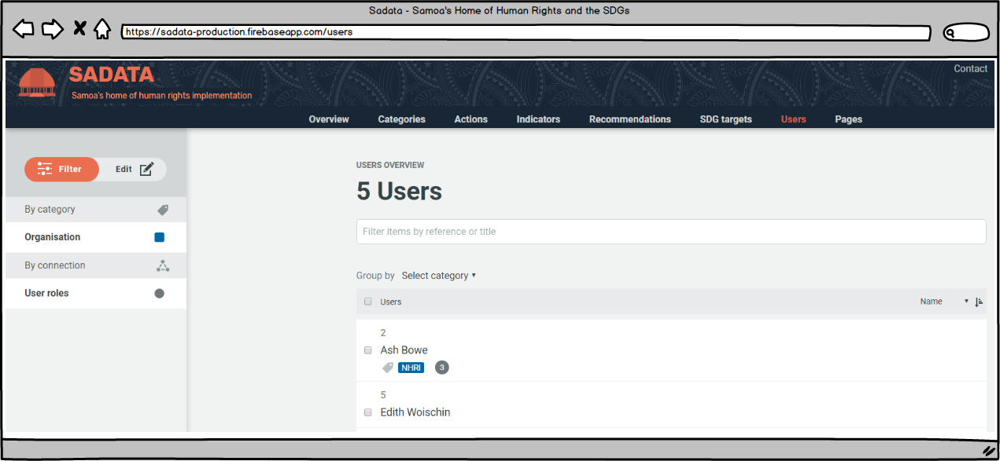
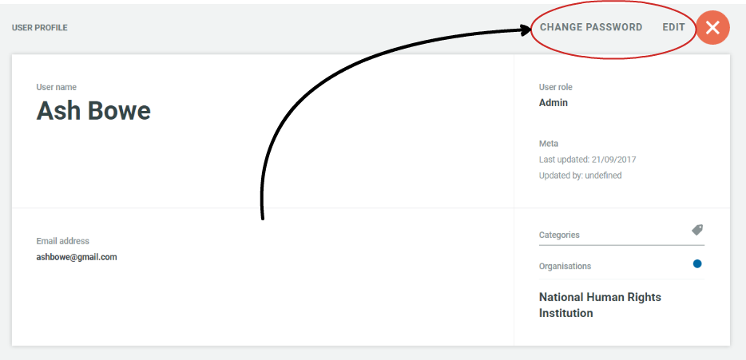
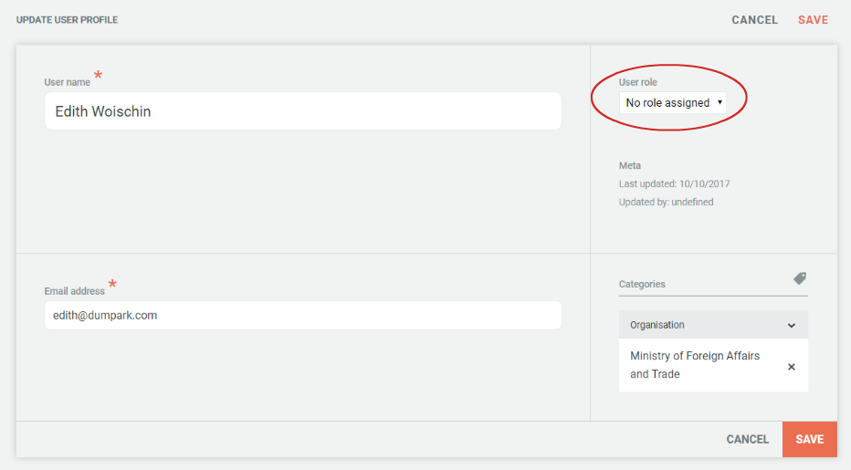
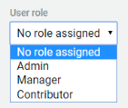

## 4.8 Users

On the Users page Administrators and Managers can manage all of the registered users and perform the following functions:

* Edit existing users \(details, user type, password, delete\)
* Assign users to a particular organisation, individually or by batch editing
* Promote a user

#### Edit Existing Users / Change Password

To edit existing users, or to reset a password the Administrator simply needs to find the relevant user using the search and filter functions and click on their name. This will bring up the following screen:

The 'Change Password' link will allow the Administrator to reset that user's password. Please notify the user of the password change and ask them to login to their account as soon as possible and reset it themselves so that their account remains secure.

Clicking on the 'Edit' link will allow the Administrator to edit all of the User details including:

* User name
* Registered email address
* User role
* Organisation of user

#### Assign users to an organisation

Through the 'Users' tab, the Administrator can assign user to a particular organisation \(i.e. record which organisation they work for/represent\). This can either be done individually by editing the user profile as described above, or through batch editing.

To assign multiple users to a particular organisation in one go the Administrator can use the batch edit function. To do this the Administrator needs to identify the users it wishes to assign to an organisation \(see image above\). Once selected the Administrator clicks on the 'Organisation' category in the left hand menu bar, selects the relevant organisation and presses 'Update'. For more information on batch editing click [here](users/actions.md).

#### Promote a user \(assign a user role\)

When a person first registers on the site they are a guest user and assigned no role. It is up to either a Manager or an Administrator to assign user roles. The following types of promotion can be carried out:

* Promote a guest user to Indicator Manager
* Promote guest users or Indicator Managers to the role of Manager
* Promote guest users, Indicator Managers or Managers to the role of Administrator \(only carried out by Administrators\)

To promote a user the Manager or Administrator should navigate to the 'Users' page on the top menu bar. They can then locate the user they wish to promote using either the search bar \(entering their name\) or the filtering options \(selecting the organisation for whom they work\). Clicking on the 'edit' button will bring up the following control box:

Clicking on the user role drop down menu \(circled\) brings up the following options:

The new role can be selected and the save button pressed to confirm the promotion.

To read more about user roles and responsibilities [click here](../members/user-roles.md).

---

