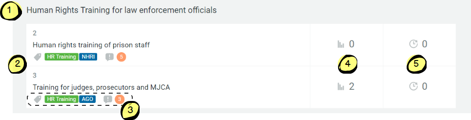
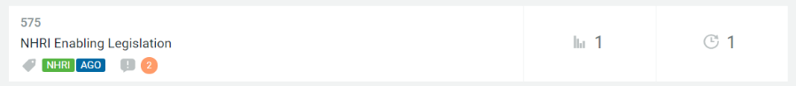
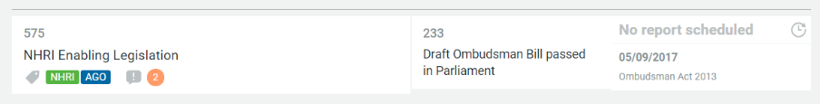
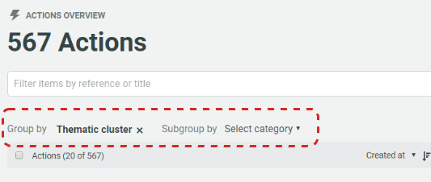
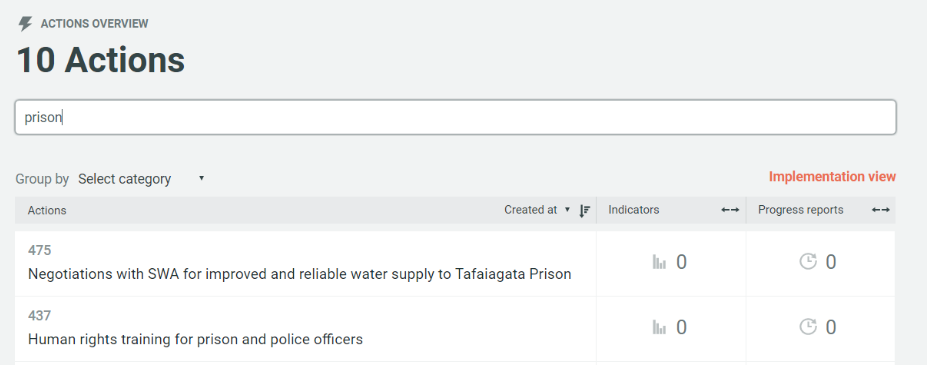
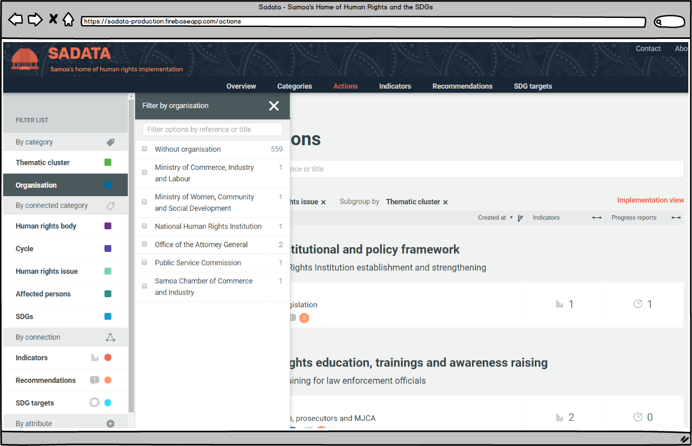

## 3.3 Actions & The Implementation Plan

The 'Actions' page contains all of the actions the Government \(and other actors\) have committed to in order to implement State human rights obligations and the SDGs.

When you first arrive on this page, the default view is to group the actions by thematic cluster. This is the National Implementation Plan.

### Page Elements and How to use Them

#### The Implementation Plan

1. The 'Human Rights Cluster', which the actions fall within. Users can click on the cluster text to see all of the actions and recommendations associated with that cluster.
2. The Actions themselves. Users can click on any of the actions to see all of the recommendations and SDGs it is helping to address, the target date, which clusters it falls within the the organisations responsible for carrying out the action.
3. The first two boxes are the categories connected to that action. In this case the 'Human Rights Training cluster and the Office of the Attorney general. Clicking on either of these tags will take the user to see all actions associated with that category. The circle with a '3' inside it indicates the number of recommendations the action is helping to address. The user can see all of the recommendations by hovering their cursor over this icon.
4. Denotes the number of indicators associated with that action. The user can expand this box by clicking on it.
5. The number of reports/pieces of data uploaded related to that action. The user can expand this box by clicking on it.

#### Expanding the Implementation Plan - 'Implementation View'

The Implementation Plan can be viewed in either 'List View' or 'Implementation View'. 'List View' gives the user an overview of the indicators and reports associated with an action whilst "Implementation View' gives the user a more detailed view and with direct access to any associated indicators and reports/data.  The user can toggle between the views in two ways:

1. By clicking on 'Implementation View' towards the top right-hand corner of the screen \(see image at top of this page\). Once selected the user can revert by clicking on 'List View' in the same place.
2. By clicking to expand the boxes in list view as described above.

The difference between the two views is illustrated below.

#### List View:

#### Implementation View

### Grouping Actions

The default grouping of all Actions contained within the database is by Thematic Cluster. The user can change this as they wish to suit their needs.

By clicking on the cross next to the grouping the user can remove that category and select their preferred category from a drop down list. A sub-group category can also be selected if required.

### Searching & Filtering

For a user there may be an overwhelming number of actions, nor may they all be of interest. The tool therefore offers a range of filtering options to help users narrow down the number of actions according to personal preferences or areas of interest.

#### Searching By Reference or Title

Each Action has a reference number and title describing the action. Users can enter words or numbers in the box indicated on the image immediately above to filter the list of actions. For example, if a user was only interested in actions relating to 'prisons' they could enter that word into the filter box and the number of actions would immediately be reduced to only those with 'prison' in the reference:

_Please note, the default number of search results returned at any time is 20. If a user wishes to view more than this at any one time they can scroll to the bottom of the page and select up to 100 per page from a drop down menu_

#### Filtering by Category, connected category, connection or attribute

The filter list is a powerful tool for users, allowing them to filter actions \(and also indicators and recommendations, as discussed in chapters below\) in a variety of ways to suit their needs. The filter list can be located on the left hand side of the screen, as per the image at the top of this section.

Clicking on any of the headings in the filter list will bring out the categories of that taxonomy:

The pop out menu shows the user all of the categories and the number beside each one shows how many actions each category has associated with it. In this example we have a number of organisations who have either one or two actions associated with them and 559 actions which have yet to be assigned to an organisation. \(Please note that this is test data\).

The user can simply select which organisation they are interested in and the filter will be applied. If the list of options is long and the user is unable to see the one they would like, there is a search box within the filter pop-out.

For instance, if we select Office of the Attorney General then we are shown the two actions owned by that organisation:

The filter the user has applied appears in the filter box in the centre of the page \(circled in red\). The user can choose to remove the filter for the Office of the Attorney General by clicking on the cross on the tag or they can choose to add another filter to reduce their search results even further. This can be done either using the filter list on the left-hand side or by typing a word or number into the filter box, as described above.

---
