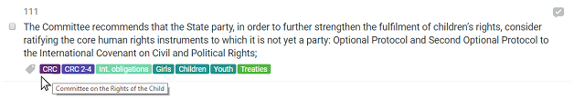

### 3.2 Categories

#### Exploring Categories

The recommendations and actions that make up the National Implementation Plan are categorised in a number of different ways \(called taxonomies or category groups\) to allow visitors to explore the information based on their specific areas of interest, or to arrange the information in a way which meets their needs. Each category has it's own unique 'tag' which is attached to recommendations, actions and indicators for users to easily identify how it is identified.

In the example above, the icons below the recommendation show the different tags that have been assigned. Hovering the cursor over any of the tags will bring up the full title, in this case 'CRC' is shown to be 'Convention on the Rights of the Child'. Clicking on any of the tags will take the user to a page specifically for that category, and display all recommendations and actions associated with it.

#### The taxonomies in detail

##### **Human Rights Bodies**

This taxonomy or group of categories covers all human rights bodies or mechanisms that can make recommendations to a State on how to implement its human rights obligations. There are three different types of categories which may fall under this taxonomy:

* Treaty body committees: For each international human rights convention \(e.g. Convention on the Rights of the Child\) there is an accompanying Treaty Body Committee. The body makes recommendations to each State that has ratified the treaty and it is these recommendations which are entered into the application and are addressed through the National Implementation Plan. 
* Universal Periodic Review: Every 4.5 years every member of the United Nations undergoes a Universal Periodic Review - a peer to peer review of each country's human rights record. The outcome document contains recommendations which are entered into the database in the same way as recommendations received from the treaty body committees. 
* Special Procedures: The United Nations has many special procedures mandate holders - either working groups or individuals who are independent experts and who are granted a mandate to examine a particular human rights issue. Arising from these type of visits is a report also containing recommendations, which will be entered into the national Implementation Plan as above.

---

##### **Cycles**

Both the treaty body reviews and the Universal Periodic Review are regular and ongoing. The 'Cycles' taxonomy allows recommendations to be classified by specific cycle. E.g. if the user wants to only view recommendations and associated actions from the most  recent Universal Periodic Review they can easily select this using the 'Cycles' category.

---

##### **Human Rights Issues**

The Office of the United Nations High Commissioner for Human Rights has developed a [Human Rights Index](http://uhri.ohchr.org/en/) which contains a classification system that is the basis for the 'Human Rights Issues' taxonomy. It helps users search by particular area of interest and see what the Government is doing in that field of work.

---

##### **Affected persons**

In the same way that 'Human Rights Issues' allows users to examine particular issues in detail, 'Affected Persons' allows the user to do that with a wide range of demographics. This is again based on the United Nations Human Rights Index system.

---

##### **Thematic clusters**

Every United nations member State receives hundreds of recommendations from the human rights bodies, the Universal Periodic Review and the Special Procedures. There is often overlap between some of the recommendations and in many case they can be similar or be the same. This can make the management of those recommendations more difficult than it needs to be. The application allows the Government to cluster recommendations into general headings to help alleviate this issue.

Clustering recommendations in this way not only helps make implementation more manageable but it also helps to identify crossover and eliminate duplication of work and reporting. The National Implementation Plan is a series of thematic clusters \(which each contain one or more recommendations\) and for each of these the Government identifies a number of actions and indicators. As more recommendations are received these can either be added to existing thematic clusters or a new cluster created.

For the user, this taxonomy once again allows them to explore potential areas of interest using the categorisation system. The thematic clusters are liable to change.

---

##### **Organisations**

The organisations taxonomy lists the Government agencies \(and others\) carrying out actions contained within the National Implementation Plan. Visitors can use this taxonomy to easily see what work any particular Ministry is doing in the areas of human rights and the SDGs at the click of a button. If your organisation is doing a variety of work related to the actions contained with the National Implementation Plan you can contact the administrator using the 'Contact' link on the website to discuss your involvement.

---

##### **Sustainable Development Goals**

In addition to being a tool which helps track and coordinate implementation a country's human rights obligations, the application also does the same in relation to the SDGs. Visitors can therefore click on this taxonomy to explore the SDG targets in more detail or to look into what actions the Government is taking to achieve the SDGs. The tool helps to draw the links between the work the Government is doing in relation to the SDGs and the work it is doing in relation to human rights, again eliminating duplication and increasing efficiency.

---

