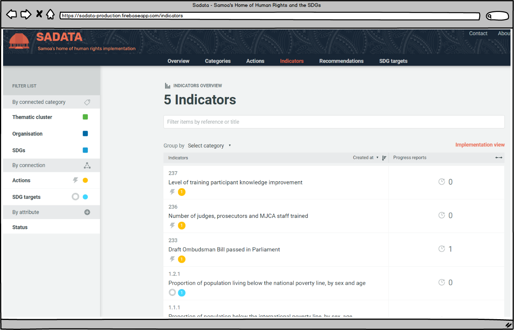

## 3.5 Indicators

Indicators are the measure of success of whether actions have been completed. For each action there should be at least one indicator and for each indicator progress reports should be uploaded demonstrating success or progress.

The Indicators tab works in a very similar manner to the [Actions (3.4)](../visitors/actions.md) tab, except its focus is on the indicators and allows users to search through the all indicators contained within the database, using the filtering tools described in the previous chapter. 

### Indicator Views

Similar to the Actions tab, there are two different views for Indicators - the 'List' view and the 'Implementation' view. Users can select which view they prefer using the link below the bottom right-hand corner of the filtering text box (see image above or read the [Actions page (3.4)](../visitors/actions.md) for more details)

### Grouping Indicators

Unlike actions, indicators do not have a default grouping already set when you land on the page.

However, the user can still group the indicators in the same manner by using the drop down menu found below the filtering text box (see image above). For more instructions read the [Actions page (3.4)](../visitors/actions.md).

### Filtering

Filtering of indicators works in the same way as filtering actions. It can be done either through entering words/numbers in the filtering text box at the top of the screen or by selecting from the filter list on the left hand side.

A difference to be aware of is that the filter list for indicators is smaller than that for actions. This is because indicators are linked directly to actions and are therefore one stage removed from categories such as Human Rights Body, Cycle, Issue, and Affected Persons. Other than having a smaller filter list, the process is the same. For more details read the [Actions page (3.4)](../visitors/actions.md).

### Accessing Progress Reports

If a progress report has been uploaded for an indicator it will be visible to any visitor (circled below).

Unless the progress report has been made private for reasons of data protection then the visitor can click on the progress report title and download the information in full.

---
