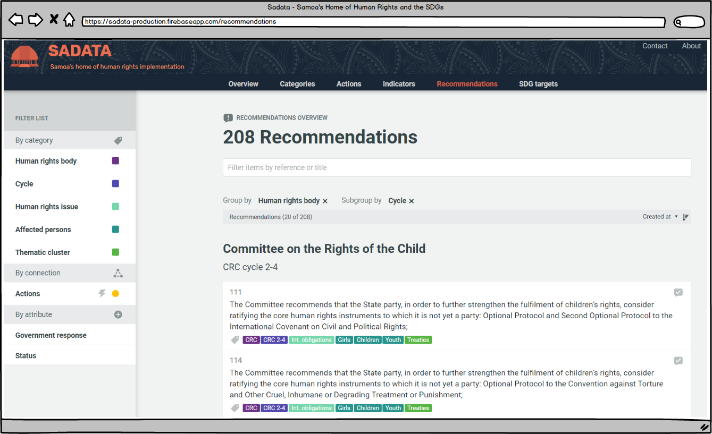

### 3.5 Recommendations

Recommendations are received from the various [Human Rights Bodies](../visitors/categories.md) and are intended to help a country implement its human rights obligations. This page is a collection of all of the recommendations a country has received. The default grouping when users arrive on this page is to group recommendations first by Human Rights Body and then by Cycle. 

The 'Recommendations' page works similarly to both the 'Actions' and 'Indicators' pages in that it allows users to explore and filter recommendations based on areas of interest. Unlike 'Actions' and 'Indicators' there is only one view with Recommendations as there is no Implementation Plan to explore in this area.

#### Grouping Recommendations

By default recommendations are grouped by human rights body and then cycle, showing users the groups of recommendations that were received at any one time. If a user would like to group the recommendations differently simply click the cross next to 'Human Rights Body' or 'Cycle' \(see image above\) and select a different grouping from the drop down menu. For more instructions read the [Actions page](../visitors/actions.md).

#### Searching & Filtering

Searching and filtering of recommendations works in the same way as filtering actions and indicators. It can be done either through entering words/numbers in the search text box at the top of the screen or by selecting from the filter list on the left hand side. This includes being able to filter by Action or by Government response \(UPR recommendations can be either accepted or 'noted' - all other recommendations received are inherently accepted by the Government by way of being party to that Treaty.

For more details on how to filter read the [Actions page](../visitors/actions.md).

---

