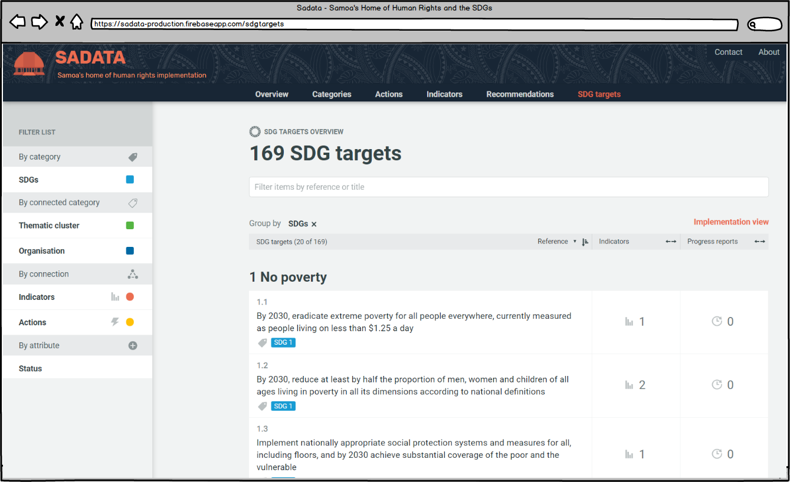

## 3.7 The Sustainable Development Goal Targets

There is significant overlap between the SDGs and human rights (E.g. SDG 5: Gender Equality and CEDAW) and drawing these links helps to increase coordination in implementation and eliminate duplication of efforts and reporting.

There are 169 internationally agreed SDG targets, all of which are contained within the application. A State using the application may choose to add additional actions and indicators that reflect how a country is setting about achieving the SDGs.

Visitors can therefore explore everything the Government is doing to achieve the SDGs and how work being undertaken in the field of human rights is also helping to achieve the SDGs and vice versa.

The 'SDG Targets' page works similarly to the 'Actions', 'Indicators' and 'Recommendations' pages in that it allows users to explore and filter recommendations based on areas of interest. Unlike 'Actions' and 'Indicators' there is only one view with Recommendations as there is no Implementation Plan to explore in this area.

### Grouping Recommendations

By default SDG targets are grouped by specific SDG, showing users the targets contained for each individual SDG. If a user would like to group the SDG trggets differently simply click the cross next to 'SDGs'' (see image above) and select a different grouping from the drop down menu. For more instructions read the [Actions page](../visitors/actions.md).

### Searching & filtering

Searching and filtering of SDG works in the same way as filtering actions, indicators and recommendations. It can be done either through entering words/numbers in the filtering text box at the top of the screen or by selecting from the filter list on the left hand side.

For more details on how to filter read the [Actions page](../visitors/actions.md).

---
